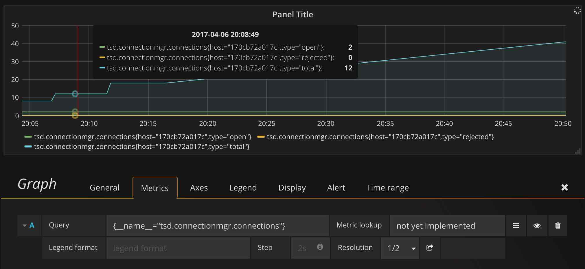

# A PromQL frontend for OpenTSDB

Currently an early proof-of-concept.

A HTTP proxy that supports a subset of the [Prometheus API][], accepting [PromQL][] queries and answering them with data pulled from OpenTSDB.

[Prometheus API]: https://prometheus.io/
[PromQL]: https://prometheus.io/docs/querying/basics/

## Requirements

* Go 1.8
* OpenTSDB 2.3+ (earlier versions could potentially be supported)

## How to use

    go install github.com/mattbostock/opentsdb-promql-frontend
    ADDR=localhost:9080 OPENTSDB_URL=http://localhost:4242 opentsdb-promql-frontend

Next, add a Prometheus datasource to Grafana and use the URL specified by the `ADDR` environment variable.

You should be able to use PromQL to query your OpenTSDB data.

## What should (or might) work

* You can query your OpenTSDB metrics in Grafana by pointing the Prometheus datasource at this proxy.

* Aggregations and arithmetric.

## Known limitations

* [PromQL][] has [tighter restrictions][] on how metrics can be named, so if you want to query metrics from OpenTSDB such as `foo.bar.baz`, you'll need to query it using `{__name__="foo.bar.baz"}`. This restriction is probably solvable.

* All queries must include a metric name - queries such as `{foo="bar"}` are not supported.

* There are no tests yet.

* Querying for a list of all metric names is not yet implemented.

* The Prometheus [Remote Read API][] (unreleased at the time of writing) is not yet supported.

* It's all very experimental - we're using the Prometheus dev-2.0 branch.

[tighter restrictions]: https://prometheus.io/docs/concepts/data_model/
[Remote Read API]: https://github.com/prometheus/prometheus/pull/2499
